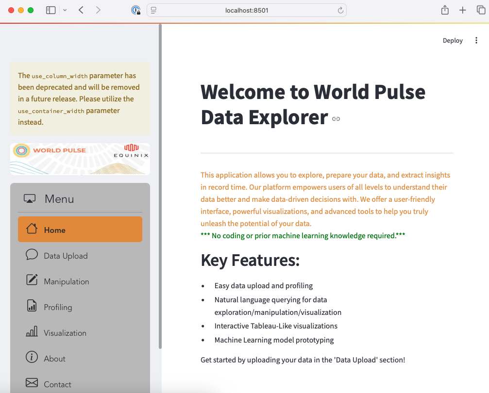

# WorldPulse Data Explorer

An interactive Streamlit app to explore, profile, manipulate and visualize WorldPulse datasets. Built in collaboration with the WeSkill volunteering program.

## Features

- **Home**: Overview and instructions.  
- **Data Upload**: Upload CSV/Excel files and preview with an interactive grid.  
- **Manipulation**: Launch a D-Tale session for ad-hoc data exploration.  
- **Profiling**: Generate an automated Pandas Profiling report.  
- **Visualization**: Create custom charts with PyGWalker and AutoViz.  
- **AutoML**: Train and compare classification/regression models via PyCaret.  
- **Preprocessing**: One-hot, target encoding, normalization, etc.

## Getting Started

```bash
# 1. Clone the repo
git clone https://github.com/equinix-labs/worldpulse-data-explorer.git
cd worldpulse-data-explorer

# 2. (Optional) Create & activate a virtual environment
python3 -m venv .venv
source .venv/bin/activate

# 3. Install dependencies
# If using Python 3.13+, use ignore-requires-python to bypass unmet python_requires constraints
pip install --ignore-requires-python -r requirements.txt

# 4. Run the app
streamlit run WorldPulseMain.py
```

The app will be accessible at `http://localhost:8501` in your web browser.

](./screenshot.png)

## Project Structure

```
worldpulse-data-explorer/
├── WorldPulseMain.py    # App entrypoint
├── home.py             # Home page
├── data_upload.py      # File upload & AgGrid preview
├── manipulation.py     # D-Tale integration
├── profiling.py        # Pandas Profiling
├── visualization.py    # PyGWalker charts
├── autoviz.py          # AutoViz charts
├── encoding.py         # Encoding utilities
├── preprocessing.py    # Scaling / normalization
├── regression_pycaret.py # Model training UI
├── requirements.txt
└── README.md
```
